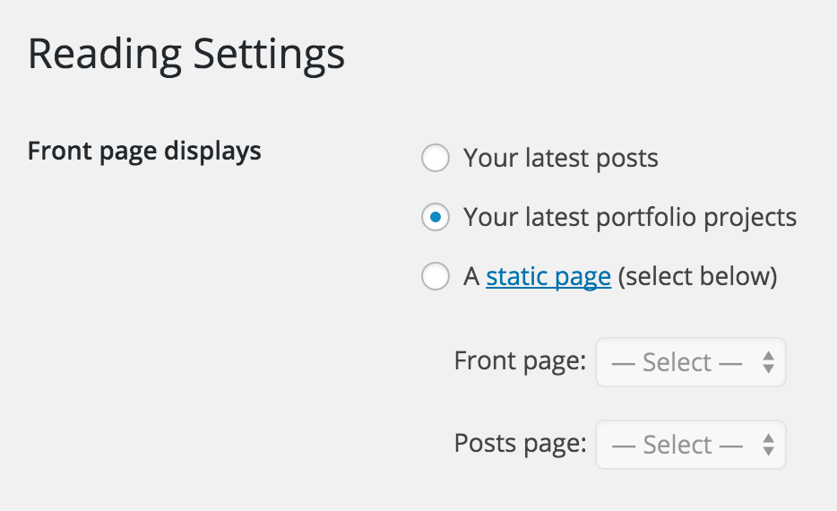

# CCP Front Page

Allow portfolio projects to be displayed on the front page.

**Contributors:** [fjarrett](https://profiles.wordpress.org/fjarrett)  
**Requires at least:** 4.3  
**Tested up to:** 4.5-beta1  
**Stable tag:** 0.0.1  

## Description ##

This is an experimental feature plugin that requires the [Custom Content Portfolio](https://wordpress.org/plugins/custom-content-portfolio/) plugin.

## Screenshots ##

### Additional option available for front page display in Settings > Reading.

## Changelog ##

### 0.0.1 - March 01, 2016 ###

* Initial release

Props [@fjarrett](https://github.com/fjarrett)
